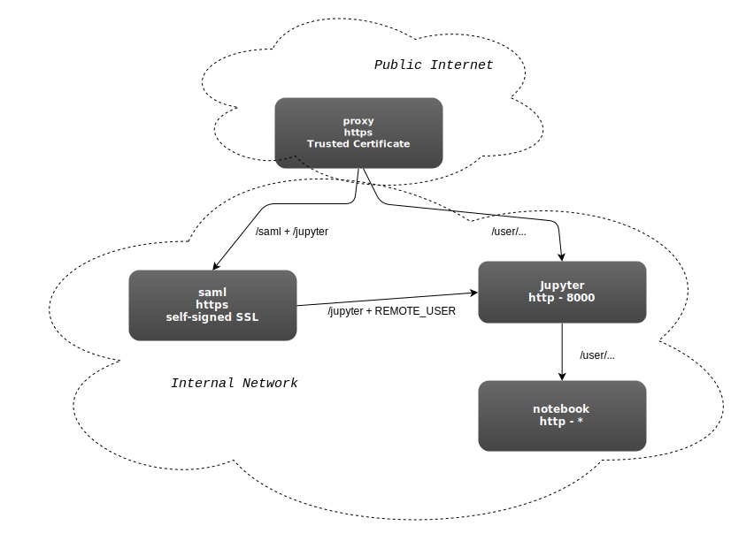

# JupyterHub-SAML

What do we need:

- docker
- docker-compose
- domain name
- SAML Preparations
- install + configure our hosts
- prepare a notebook

### docker
Please make sure you have docker up and running on your system. 

~~~
https://docs.docker.com/get-started/
~~~

#### docker-compose
Please make sure also docker-compose is installed on your system.

~~~
https://docs.docker.com/compose/install/
~~~

### domain name
For this demomnstration we like to have an domain name that we can reach on the public internet. If you have a domain name already and you hav control over de the DNS settings of that domain, then the recommendation is to reserve a subdomain and register a A-record to the IP-Address of your Docker VPS/Machine. Make sure that port 443 is open on the firewall.

### SAML Preparations
Here we need several steps.

If you are new to SAML and Federated Authentication, here is some good readings that will you get prepared with the required background information

~~~
https://wiki.surfnet.nl/display/surfconextdev/Schematic+overview
~~~

Our VPS machine will act as a "Service Provider"
During this demonstration, we make use of surfconext to connect to our "Identity Providers"

In preparation for that we need the following:

#### Service Provider key-set

The following commands will generate a self-signed keyset that is OK for this demonstration.
 
~~~
openssl genrsa -out server.key
openssl req -new -x509 -key server.key -out server.crt -days 365
~~~

#### Service Provide Metadata

Here we need to prepare Metadata that we can pass on to the Identity Provider in order to establish a bilateral "trust-relation" between us.

This template can be used and adjusted where appropriate

File: ***metadata.xml***

~~~
<?xml version="1.0"?>
<!--
     Author: Harry Kodden
-->
<md:EntityDescriptor xmlns:md="urn:oasis:names:tc:SAML:2.0:metadata" xml:id="MyData" entityID="https://%%% SERVICE NAME %%%/sp/metadata-1f68bf6b-4f43-41d4-8460-f997a94ca485">
   <ds:Signature xmlns:ds="http://www.w3.org/2000/09/xmldsig#">
    <ds:SignedInfo>
      <ds:CanonicalizationMethod Algorithm="http://www.w3.org/2001/10/xml-exc-c14n#"/>
      <ds:SignatureMethod Algorithm="http://www.w3.org/2000/09/xmldsig#rsa-sha1"/>
      <ds:Reference URI="#MyData">
        <ds:Transforms>
          <ds:Transform Algorithm="http://www.w3.org/2000/09/xmldsig#enveloped-signature"/>
          <ds:Transform Algorithm="http://www.w3.org/2001/10/xml-exc-c14n#"/>
        </ds:Transforms>
        <ds:DigestMethod Algorithm="http://www.w3.org/2000/09/xmldsig#sha1"/>
        <ds:DigestValue/>
      </ds:Reference>
    </ds:SignedInfo>
    <ds:SignatureValue/>
    <ds:KeyInfo>
      <ds:KeyName/>
    </ds:KeyInfo>
  </ds:Signature>  <md:Extensions xmlns:alg="urn:oasis:names:tc:SAML:metadata:algsupport">
    <alg:DigestMethod Algorithm="http://www.w3.org/2001/04/xmlenc#sha512"/>
    <alg:DigestMethod Algorithm="http://www.w3.org/2001/04/xmldsig-more#sha384"/>
    <alg:DigestMethod Algorithm="http://www.w3.org/2001/04/xmlenc#sha256"/>
    <alg:DigestMethod Algorithm="http://www.w3.org/2001/04/xmldsig-more#sha224"/>
    <alg:DigestMethod Algorithm="http://www.w3.org/2000/09/xmldsig#sha1"/>
    <alg:SigningMethod Algorithm="http://www.w3.org/2001/04/xmldsig-more#ecdsa-sha512"/>
    <alg:SigningMethod Algorithm="http://www.w3.org/2001/04/xmldsig-more#ecdsa-sha384"/>
    <alg:SigningMethod Algorithm="http://www.w3.org/2001/04/xmldsig-more#ecdsa-sha256"/>
    <alg:SigningMethod Algorithm="http://www.w3.org/2001/04/xmldsig-more#ecdsa-sha224"/>
    <alg:SigningMethod Algorithm="http://www.w3.org/2001/04/xmldsig-more#rsa-sha512"/>
    <alg:SigningMethod Algorithm="http://www.w3.org/2001/04/xmldsig-more#rsa-sha384"/>
    <alg:SigningMethod Algorithm="http://www.w3.org/2001/04/xmldsig-more#rsa-sha256"/>
    <alg:SigningMethod Algorithm="http://www.w3.org/2009/xmldsig11#dsa-sha256"/>
    <alg:SigningMethod Algorithm="http://www.w3.org/2001/04/xmldsig-more#ecdsa-sha1"/>
    <alg:SigningMethod Algorithm="http://www.w3.org/2000/09/xmldsig#rsa-sha1"/>
    <alg:SigningMethod Algorithm="http://www.w3.org/2000/09/xmldsig#dsa-sha1"/>
  </md:Extensions>
    <md:SPSSODescriptor protocolSupportEnumeration="urn:oasis:names:tc:SAML:2.0:protocol">
    <md:Extensions>
      <mdui:UIInfo xmlns:mdui="urn:oasis:names:tc:SAML:metadata:ui">
        <mdui:DisplayName xml:lang="nl">My Velocity Service</mdui:DisplayName>
        <mdui:DisplayName xml:lang="en">My Velocity Service</mdui:DisplayName>
        <mdui:Description xml:lang="nl">Een mooie voorbeelddienst om te laten zien hoe Shibboleth werkt</mdui:Description>
        <mdui:Description xml:lang="en">A nice example Service to show how to work with Shibboleth and SURFconext</mdui:Description>
        <mdui:Logo height="300" width="500">https://%%% DOMAIN %%%/static/img/logo.png</mdui:Logo>
      </mdui:UIInfo>
      <init:RequestInitiator xmlns:init="urn:oasis:names:tc:SAML:profiles:SSO:request-init" Binding="urn:oasis:names:tc:SAML:profiles:SSO:request-init" Location="https://%%% DOMAIN %%%/saml/Login"/>
    </md:Extensions>
    <md:KeyDescriptor>
      <ds:KeyInfo xmlns:ds="http://www.w3.org/2000/09/xmldsig#">
        <ds:KeyName>%%% SERVICE NAME %%%</ds:KeyName>
        <ds:X509Data>
          <ds:X509SubjectName>CN=%%% SERVICE NAME %%%</ds:X509SubjectName>
          <ds:X509Certificate>%%% X509 %%%</ds:X509Certificate>
        </ds:X509Data>
      </ds:KeyInfo>
      <md:EncryptionMethod Algorithm="http://www.w3.org/2009/xmlenc11#aes128-gcm"/>
      <md:EncryptionMethod Algorithm="http://www.w3.org/2009/xmlenc11#aes192-gcm"/>
      <md:EncryptionMethod Algorithm="http://www.w3.org/2009/xmlenc11#aes256-gcm"/>
      <md:EncryptionMethod Algorithm="http://www.w3.org/2001/04/xmlenc#aes128-cbc"/>
      <md:EncryptionMethod Algorithm="http://www.w3.org/2001/04/xmlenc#aes192-cbc"/>
      <md:EncryptionMethod Algorithm="http://www.w3.org/2001/04/xmlenc#aes256-cbc"/>
      <md:EncryptionMethod Algorithm="http://www.w3.org/2001/04/xmlenc#tripledes-cbc"/>
      <md:EncryptionMethod Algorithm="http://www.w3.org/2009/xmlenc11#rsa-oaep"/>
      <md:EncryptionMethod Algorithm="http://www.w3.org/2001/04/xmlenc#rsa-oaep-mgf1p"/>
    </md:KeyDescriptor>
    <md:ArtifactResolutionService Binding="urn:oasis:names:tc:SAML:2.0:bindings:SOAP" Location="https://%%% DOMAIN %%%/saml/Artifact/SOAP" index="1"/>
    <md:SingleLogoutService Binding="urn:oasis:names:tc:SAML:2.0:bindings:SOAP" Location="https://%%% DOMAIN %%%/saml/SLO/SOAP"/>
    <md:SingleLogoutService Binding="urn:oasis:names:tc:SAML:2.0:bindings:HTTP-Redirect" Location="https://%%% DOMAIN %%%/saml/SLO/Redirect"/>
    <md:SingleLogoutService Binding="urn:oasis:names:tc:SAML:2.0:bindings:HTTP-POST" Location="https://%%% DOMAIN %%%/saml/SLO/POST"/>
    <md:SingleLogoutService Binding="urn:oasis:names:tc:SAML:2.0:bindings:HTTP-Artifact" Location="https://%%% DOMAIN %%%/saml/SLO/Artifact"/>
    <md:AssertionConsumerService Binding="urn:oasis:names:tc:SAML:2.0:bindings:HTTP-POST" Location="https://%%% DOMAIN %%%/saml/SAML2/POST" index="1"/>
    <md:AssertionConsumerService Binding="urn:oasis:names:tc:SAML:2.0:bindings:HTTP-POST-SimpleSign" Location="https://%%% DOMAIN %%%/saml/SAML2/POST-SimpleSign" index="2"/>
    <md:AssertionConsumerService Binding="urn:oasis:names:tc:SAML:2.0:bindings:HTTP-Artifact" Location="https://%%% DOMAIN %%%/saml/SAML2/Artifact" index="3"/>
    <md:AssertionConsumerService Binding="urn:oasis:names:tc:SAML:2.0:bindings:PAOS" Location="https://%%% DOMAIN %%%/saml/SAML2/ECP" index="4"/>
  </md:SPSSODescriptor>
  <md:Organization>
    <md:OrganizationName xml:lang="nl">Voorbeeld (NL)</md:OrganizationName>
    <md:OrganizationName xml:lang="en">Example (NL)</md:OrganizationName>
    <md:OrganizationDisplayName xml:lang="nl">Voorbeeld Service</md:OrganizationDisplayName>
    <md:OrganizationDisplayName xml:lang="en">Example Service</md:OrganizationDisplayName>
    <md:OrganizationURL xml:lang="nl">https://%%% DOMAIN %%%/</md:OrganizationURL>
    <md:OrganizationURL xml:lang="en">https://%%% DOMAIN %%%/</md:OrganizationURL>
  </md:Organization>
  <md:ContactPerson contactType="support">
    <md:GivenName>John</md:GivenName>
    <md:SurName>Doe</md:SurName>
    <md:EmailAddress>John.Doe@example.org</md:EmailAddress>
  </md:ContactPerson>
  <md:ContactPerson contactType="technical">
    <md:GivenName>John</md:GivenName>
    <md:SurName>Doe</md:SurName>
    <md:EmailAddress>John.Doe@example.org</md:EmailAddress>
  </md:ContactPerson>
  <md:ContactPerson contactType="administrative">
    <md:GivenName>John</md:GivenName>
    <md:SurName>Doe</md:SurName>
    <md:EmailAddress>John.Doe@example.org</md:EmailAddress>
  </md:ContactPerson>
</md:EntityDescriptor>
~~~

Please replace at least these placeholders with the appropriate valeus:

| Placeholder | To be replaced by |
| ------ | ----------- |
| %%% DOMAIN %%%   | the full domain name, for example: ***https://www.example.org*** |
| %%% X509 %%% | output of command ***openssl x509 -in server.crt*** 
|	|(please remove the lines BEGIN CERTICATE and END CERTIFICATE). |
| %%% SERVICE NAME %%% | The Service Name describing your service |

Before this Metadata can be send to the Identity Provider, we need to sign the contents.

This can be achieved from command line by using '***xmlsec1***'

~~~
xmlsec1 --sign --output signed_metadata.xml --privkey-pem server.key metadata.xml
~~~

 

## Install + configure our hosts

As presented in the diagram earlier, we have 3 host components.

- proxy
- saml
- jupyter

The proxy is connected to the public internet, the others are hosted within our shielded internal network.

The componens are specified in our docker-compose file: ***docker-compose.yml***

~~~
version: '2'
services:

  proxy:
    hostname: ${MY_HOSTNAME}
    image: nginx:alpine
    networks:
      - front-end
      - back-end
    ports:
      - "443:443"
      - "80:80"
    volumes:
      - $PWD/etc/letsencrypt:/etc/letsencrypt:ro
      - $PWD/etc/nginx.template:/etc/nginx/nginx.template:ro
      - $PWD/img:/www/data/img:ro
    restart: always
    command: 'sh -c "cat /etc/nginx/nginx.template | sed \"s/__MY_DOMAIN_NAME__/${MY_HOSTNAME}/\" > /etc/nginx/nginx.conf && nginx -g \"daemon off;\""'

  saml:
    hostname: ${MY_HOSTNAME}
    build:
      context: saml
      dockerfile: Dockerfile
    networks:
      - back-end
    ports:
      - "443"
    environment:
      SERVER_NAME: ${MY_HOSTNAME}
      SHIBBOLETH_SP_ENTITY_ID: ${MY_ENTITY_ID}
      SHIBBOLETH_SP_CERT: /run/sp/sp-cert.pem
      SHIBBOLETH_SP_PRIVKEY: /run/sp/sp-key.pem
      SHIBBOLETH_SP_METADATA_PROVIDER_XML_FILE: /run/sp/sp-metadata-myvelocity.xml
    volumes:
      - $PWD/etc/sp:/run/sp:ro
      - $PWD/etc/sp/myvelocity-shibboleth2.xml:/etc/shibboleth/shibboleth2.xml:ro
      - $PWD/etc/sp/attribute-map.xml:/etc/shibboleth/attribute-map.xml:ro
      - $PWD/etc/letsencrypt:/etc/letsencrypt:ro
      - $PWD/etc/idp/surfconext.test/certificate.pem:/opt/shibboleth-sp/etc/shibboleth/surfconext.pem:ro

  jupyter:
    build:
      context: $PWD/jupyterhub
      dockerfile: Dockerfile.jupyterhub
      args:
        - JUPYTERHUB_VERSION=${MY_JUPYTERHUB_VERSION}
    networks:
      - back-end
    ports:
      - "8000"
    volumes:
      - "/var/run/docker.sock:/var/run/docker.sock:rw"
      - $PWD/etc/jupyterhub:/srv/jupyterhub
      - $PWD/var/jupyter:/volumes/jupyter
    command: jupyterhub

networks:
  front-end:
    driver: bridge
  back-end:
    driver: bridge
~~~

Special attenticon for the network specification at the bottom of this file. Especially the "back-end" network is relevant for the juputer interaction between the notebook and the hub. Later we will see that the the network name is specified within the JupyterHub-Configuration file.

#### Configure NGINX - Reverse Proxy

The NGINX Proxy functions as our single internet connected host. The proxy takes care of SSL-offloading and passing the requests downstream to the other components

The following proxying takes place:

- static contents like images are served directly.
- all requests to ***/jupyter*** and ***/hub*** and forwarded to be handled by the SAML host. The SAML host enforces authenticated session before additional services can be offered to the user.
- all request to ***/user*** are passed on to the Jupyter host. This host will forward request to the appropriate runnint ***notebook*** but only if there is an active valid session for the user.
- Jupyter User Notebooks requests are directly passed onto the JupyterHUB and may bypass the SAML host.
- All ***/saml*** requests are forwarded ot the SAML host.

Here is the most relevant part of the file ***etc/nginx.template***

~~~
    location /img {
      root /www/data;
    }

    location /jupyter {
      proxy_pass         https://saml/jupyter;
    }

    location /hub {
      proxy_pass         https://saml/jupyter/hub;
    }

    location /user {
      proxy_pass         http://jupyter:8000/user;
    }

    location /saml {
      proxy_pass         https://saml/saml;
    }
~~~

#### Configure SAML (Apache + Shibboleth)

~~~
<VirtualHost *:80>
  ServerName http://%%SERVER_NAME%%:80
  RewriteEngine On
  RewriteCond %{HTTPS} off
  RewriteRule ^ https://%{HTTP_HOST}:443%{REQUEST_URI} [R=302,L,QSA]
</VirtualHost>

<VirtualHost *:443>
  ServerName https://%%SERVER_NAME%%:443

  RedirectMatch 301 /jupyter/hub/logout https://%%SERVER_NAME%%/saml/Logout?return=https%3A//%%SERVER_NAME%%/jupyter

  ErrorLog ${APACHE_LOG_DIR}/error.log
  CustomLog ${APACHE_LOG_DIR}/access.log combined

  LogLevel warn

  Header always set Strict-Transport-Security "max-age=63072000; includeSubDomains"

  SSLEngine on
  SSLProtocol all -SSLv2 -SSLv3
  SSLCipherSuite EECDH+AESGCM:EDH+AESGCM:AES256+EECDH:AES256+EDH
  SSLHonorCipherOrder on

  SSLCertificateFile /etc/apache2/cert.pem
  SSLCertificateKeyFile /etc/apache2/privkey.pem

  <Location "/saml">
    SetHandler shib
  </Location>

  <Location /jupyter>
    AuthType shibboleth
    ShibRequestSetting requireSession 1
    Require valid-user

    RewriteEngine On
    RewriteCond %{LA-U:REMOTE_USER} (.*)
    RewriteRule . - [E=RU:%1]
    RequestHeader set REMOTE_USER "%{RU}e" env=RU
  </Location>

  ProxyPreserveHost On

  ProxyPass /jupyter              http://jupyter:8000/
  ProxyPassReverse /jupyter       http://jupyter:8000/

  ProxyPass /jupyter/hub          http://jupyter:8000/hub
  ProxyPassReverse /jupyter/hub   http://jupyter:8000/hub

</VirtualHost>
~~~

## Prepare a notebook

xxx

